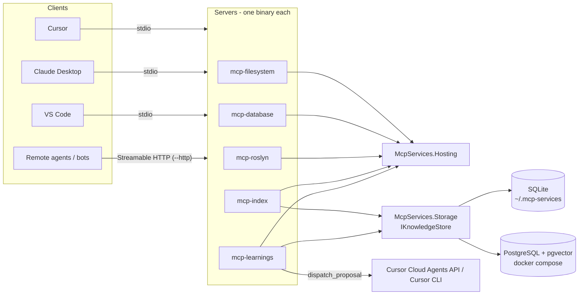

# Architecture

## Solution layout

| Project | Role |
|---|---|
| `src/shared/McpServices.Hosting` | `McpServerHost.RunAsync(args, descriptor, configure)`: parses shared options, picks stdio or Streamable HTTP, wires logging to stderr, registers the `server_info` tool. Also `CommandLine`, `ToolJson`, `Paging`, `TextDiff`, `ToolException`/`ToolGuard`, `ServerStartupException`. |
| `src/shared/McpServices.Storage` | `IKnowledgeStore` with `SqliteStore` and `PostgresStore`, versioned `Migration`s with a SQL text per dialect, `SqlDialect` helpers (upsert, ILIKE, full-text), `Db` extension methods over `DbConnection`, `Rrf` (reciprocal rank fusion), `VectorCodec`, `SecretRedactor`, `RepoIdentity`, `StoreInitializer` (migrations run once, guarded), `KnowledgeStoreFactory.Resolve` (`--store` / env / default file). |
| `src/servers/McpServices.FileSystem` | `PathGuard` (allowed roots, symlink resolution), `FileEditor` (line-based edits, whitespace-insensitive fallback, unified diff), 13 tools. |
| `src/servers/McpServices.Database` | `IDatabaseProvider` implementations for SQLite, PostgreSQL (Npgsql), SQL Server; `SqlGuard` (single statement, read-only starters, no comments/`;` smuggling); `DatabaseRegistry` from `--db` and `MCP_DB__<alias>`; schema resource `db://{alias}/schema`. |
| `src/servers/McpServices.Roslyn` | `WorkspaceManager` (MSBuildWorkspace sessions per `workspaceId`, disk refresh, apply), `Symbols` (lookup/formatting), `CodeFixCatalog`, tool classes per area (workspace, navigation, diagnostics, refactoring, snippets, scripting, build). |
| `src/servers/McpServices.Index` | `Indexer` (walker, content hashing, language detection, C# symbol extraction, markdown headings), `FreshnessChecker` (git HEAD/working tree vs indexed state), `IndexCoordinator` (auto-refresh policies, writer lock), `SearchService` (FTS + symbol + feedback + vector, fused with RRF), `NotesService`, `RelatedFilesService` (git co-change), `EmbeddingService`, `IndexWatcher`, CLI mode + git hooks. |
| `src/servers/McpServices.Learnings` | `LearningsRepository` (fingerprint dedupe, occurrences, feedback), `RecommendationService` (confidence with time decay, conflict detection), `LearningsMarkdown` (agentPacks `docs/learnings.md` import/export), `ProposalService` + `ImprovementPrompt`, dispatchers (dry-run, Cursor Cloud Agents API, Cursor CLI, webhook) behind `DispatchService` policy guards. |
| `tests/McpServices.TestSupport` | `ServerFixture` starts a server assembly as a child process over stdio with the SDK `McpClient`; `EnvironmentFactAttribute` for infrastructure-dependent tests. |

## Hosting: one binary, two transports

`McpServerHost.RunAsync` handles `--help`, `--version`, `--http`, `--port`, `--host`, `--log-level` and then calls the server's `configure(HostContext)` callback. The callback registers services, exposes configuration for `server_info` (`context.Expose(key, value)`) and registers tool/resource/prompt classes via `context.Mcp.WithTools<T>(ToolJson.Options)`.

- **stdio**: `Host.CreateApplicationBuilder` + `WithStdioServerTransport()`. Console logging is forced to stderr and `Console.Out` is redirected to stderr as well, so nothing but protocol frames reaches stdout (the SDK writes frames to the raw stdout stream).
- **HTTP**: `WebApplication.CreateBuilder` + `WithHttpTransport()` + `MapMcp("/mcp")`. Binds `127.0.0.1` unless `--host` says otherwise; there is deliberately no authentication layer, that belongs in a reverse proxy.
- Start-up problems (missing directory, bad connection string) throw `ServerStartupException` → usage + message on stderr, exit code 2. Tool-level problems throw `ToolException` (an `McpException`), which the SDK returns as `isError: true` with the message, so agents can self-correct; any other exception is masked by the SDK.
- `ToolJson.Options`: camelCase, enums as lower-case strings, nulls omitted. Tools return anonymous objects or records; the SDK serializes them as the text content.
- `Paging.Page(list, pageToken, pageSize)` returns `{ items, totalCount, nextPageToken }` with an opaque base64 offset token; large results are always capped before paging.

## Storage: SQLite or PostgreSQL through one interface

`IKnowledgeStore` opens `DbConnection`s and exposes the dialect. Servers write SQL once per dialect in `Migration(Version, Name, SqliteSql, PostgresSql)`; `StoreInitializer` applies pending migrations under a lock the first time a tool needs the store. `Db` extensions (`ExecuteAsync`, `QueryAsync`, `ScalarAsync`, anonymous-object parameters) hide the ADO.NET differences; enums are stored as lower-case strings, timestamps as Unix milliseconds, string lists as JSON, vectors as float32 BLOBs (SQLite) or `vector` (pgvector, in-process cosine fallback when the extension is missing).

`--store sqlite:<file>` is the default (`~/.mcp-services/<server>/<file>`, WAL mode, busy timeout, one writer lock per process). `--store postgres:<connection string>` switches to the shared store; `docker/docker-compose.yml` provides `pgvector/pgvector:pg17`. Full-text search uses FTS5 on SQLite and `tsvector` + GIN on PostgreSQL with the same query semantics (`SqlDialect.FullTextQuery`).

## Roslyn server internals

1. `WorkspaceManager.RegisterMsBuild()` runs before any MSBuild type is JIT-compiled (`MSBuildLocator.RegisterInstance` with the newest SDK found). The `Microsoft.Build.Framework` package is referenced with `ExcludeAssets="runtime"` so the SDK's copy wins.
2. `LoadAsync` opens a `.sln`/`.slnx`/`.csproj` with `MSBuildWorkspace` (design-time build), drops non-C# projects, records load diagnostics and file stamps, and returns a `WorkspaceSession` with a stable `workspaceId` (`<name>-<sha256 prefix>`).
3. `GetAsync` resolves the id (or a path, or the single loaded/auto-discoverable solution) and runs `RefreshAsync`: one `stat` per document, re-reading changed files, dropping deleted ones and adding new `.cs` files under each project directory. Project-file changes set `needsReload`, so agents know when `load_solution reload=true` is due.
4. Read tools work on `session.Solution`. Refactoring tools produce a new `Solution`, diff it (`TextDiff.Unified`), optionally check for new compile errors (`rename_symbol`), and only with `dryRun=false` call `ApplyAsync`, which writes the changed documents and adopts the snapshot.
5. `CodeFixCatalog` instantiates `CodeFixProvider`s from `Microsoft.CodeAnalysis.CSharp.Features`/`Features` plus the analyzer assemblies referenced by the project (NetAnalyzers, StyleCop, ...), and a small built-in fixer for CS8019 because Roslyn's own is tied to the IDE-only IDE0005 analyzer.
6. `run_script` uses `Microsoft.CodeAnalysis.CSharp.Scripting` in-process with `Console.Out` captured under a semaphore; `--no-scripting` removes the tool entirely. `build_project`/`test_run` spawn `dotnet build`/`dotnet test` and parse MSBuild lines and TRX reports; `--no-build` removes them.

## Index server: staying correct when nobody calls it

The index can go out of sync because files change outside MCP (IDE saves, `git checkout`, rebases, another agent). The defences are layered:

- Every indexed file stores its content hash; `index_repository` re-hashes only files whose size/mtime changed and removes deleted ones (`--force` re-hashes everything).
- `FreshnessChecker` compares the indexed git HEAD and dirty-file set with the current checkout and reports `stale` with the changed files; `index_status` never modifies anything.
- `--auto-refresh inline` (default) refreshes small deltas before answering a search, `background` answers first and refreshes after, `off` leaves it to you.
- `--watch` runs a `FileSystemWatcher` per root and refreshes in the background with debouncing.
- Git hooks (`scripts/install-git-hooks.sh`) call the CLI mode `mcp-index index <root> --quiet` after checkout/merge/commit; CLI and server share the same writer lock, so a concurrent run simply skips.
- `verify_index` re-checks hashes and (SQLite) FTS consistency and repairs orphans; `reindex` rebuilds from scratch while keeping notes and feedback.
- Notes remember the files they were written about and `recall` marks them `possiblyStale` when those files changed.

Search fuses independent rankers with reciprocal rank fusion: BM25 full-text, exact/prefix symbol matches, usefulness feedback (`mark_useful`, decaying) and, when `--embeddings` is configured, vector similarity from Ollama or an OpenAI-compatible endpoint. Embeddings are computed after indexing (inline budget, rest in the background) and never block a query.

## Learnings server: from observations to pull requests

1. Agents call `record_learning` (worked / failed / partial, title, detail, tags, files, tool). A fingerprint (outcome + normalized title + repo + files + tool) deduplicates repeats; repeats bump `occurrences` and refresh `lastSeenAt`.
2. `get_recommendations` returns Do / Avoid / Caution lists for a task, scored by confidence = strength (occurrences and usefulness) × time decay (half-life 90 days), with contradicting learnings flagged as conflicts.
3. `import_learnings_md`/`export_learnings_md` round-trip the agentPacks `docs/learnings.md` format (squad entries), so existing knowledge is not lost and the file stays the human-readable log.
4. `create_proposal` bundles corroborated learnings into an improvement prompt (goal, evidence, likely files, constraints, acceptance criteria, always a draft PR) for a whitelisted target repository.
5. `dispatch_proposal` hands it over according to policy: `dry-run` writes the prompt to disk, `cursor-cloud` posts to the Cursor Cloud Agents API (`POST /v0/agents`, `CURSOR_API_KEY` from the environment, retries on 5xx/429) and later polls the PR URL, `cursor-cli` clones, runs `agent -p`, commits and opens a draft PR with `gh`, `webhook` posts the proposal JSON. External dispatch requires `--dispatch manual|auto`, `minCorroborations` occurrences, stays under a daily cap, and every attempt is logged in the `dispatches` table.

## Testing strategy

Servers are tested the way clients use them: `ServerFixture` launches the built server DLL as a child process with `StdioClientTransport`, then calls `tools/list` and real tools. Fake HTTP servers (`HttpListener`) stand in for the Cursor API and embedding endpoints; stub `agent`/`gh` scripts on `PATH` and a local bare git repository exercise the CLI dispatcher. The Roslyn tests copy `tests/fixtures/SampleSolution` to a temp directory, restore it and load it through MSBuild, so refactoring tests can write files safely. PostgreSQL contract tests run only when `MCP_TEST_POSTGRES` is set.
