# Omni design diagrams

Source: infrastructure-azure-white-label PR #9 at 16461bb, docs/extra/mcp-omni, plus the local test diagrams from the MCP Services room.

This file is the full diagram set. Do not delete a diagram. Do not turn a diagram into prose.

Code in this PR is the local slice only (diagrams 14 and 15). Diagrams 1 to 13 are the later APIM gateway. Do not implement APIM, JWT, or Azure in this PR.

## 1. Overview (later gateway)

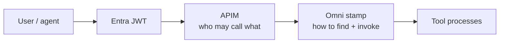

## 2. Full path, auth in APIM (later gateway)

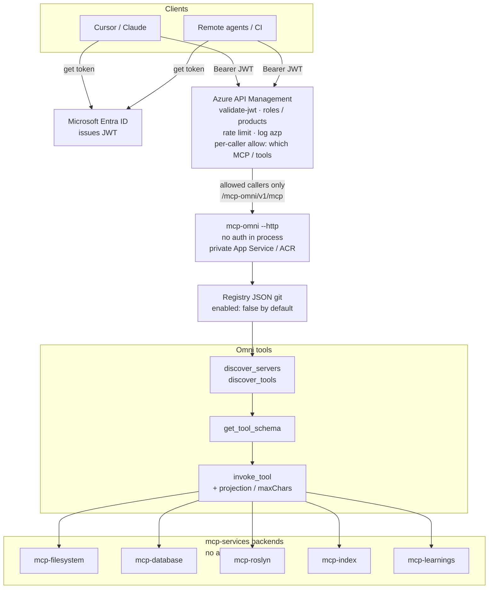

## 3. Sequence, client never talks to Omni directly (later gateway)

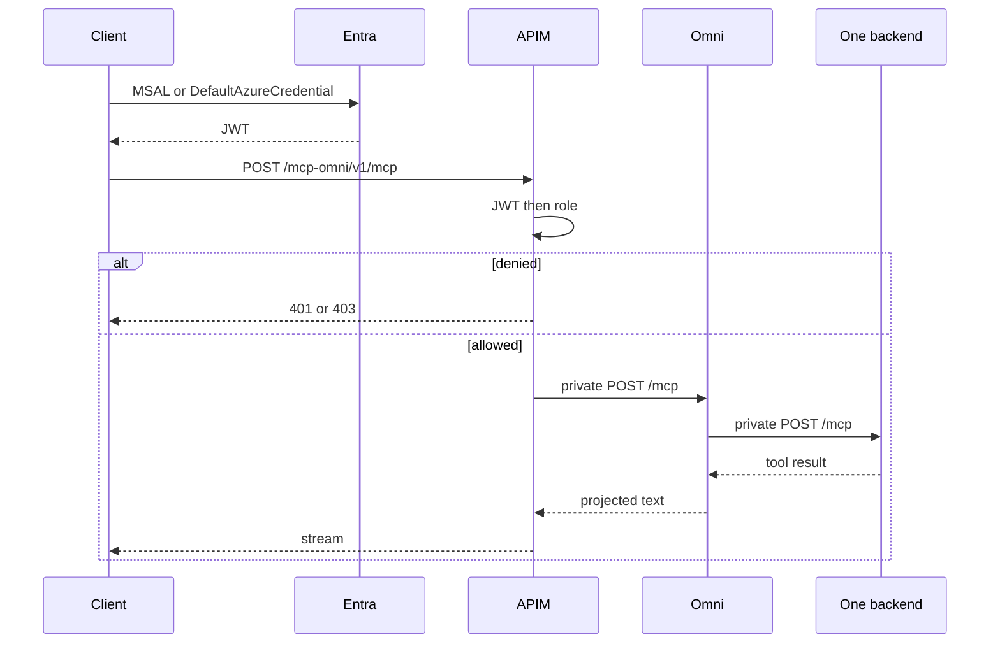

## 4. Trust boundaries (later gateway)

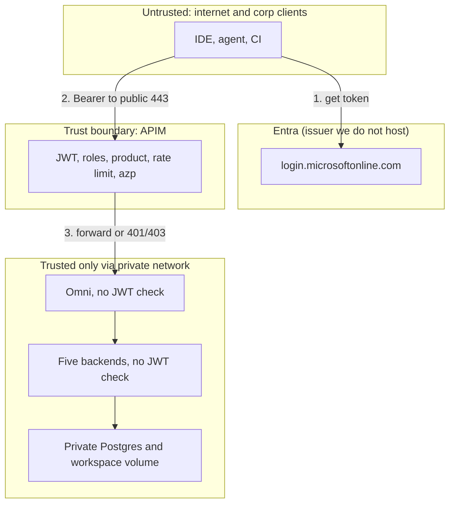

## 5. JWT acquisition (later gateway)

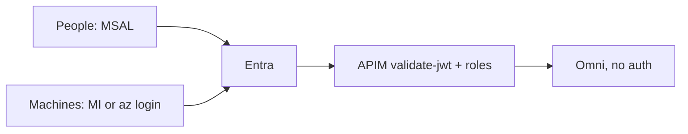

## 6. One stamp (later gateway)

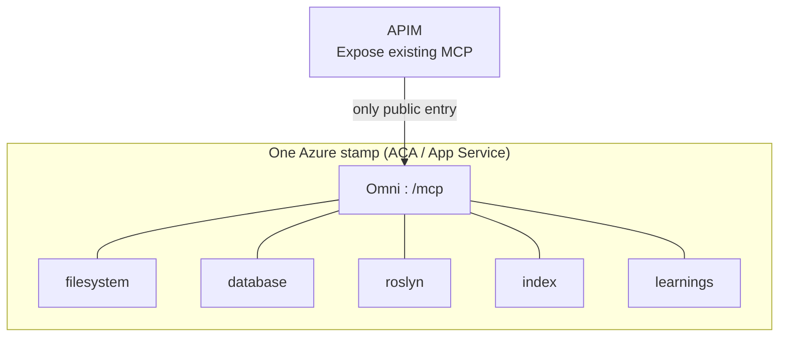

## 7. Alice allowed, Bob denied (later gateway)

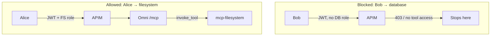

## 8. Happy path and deny (later gateway)

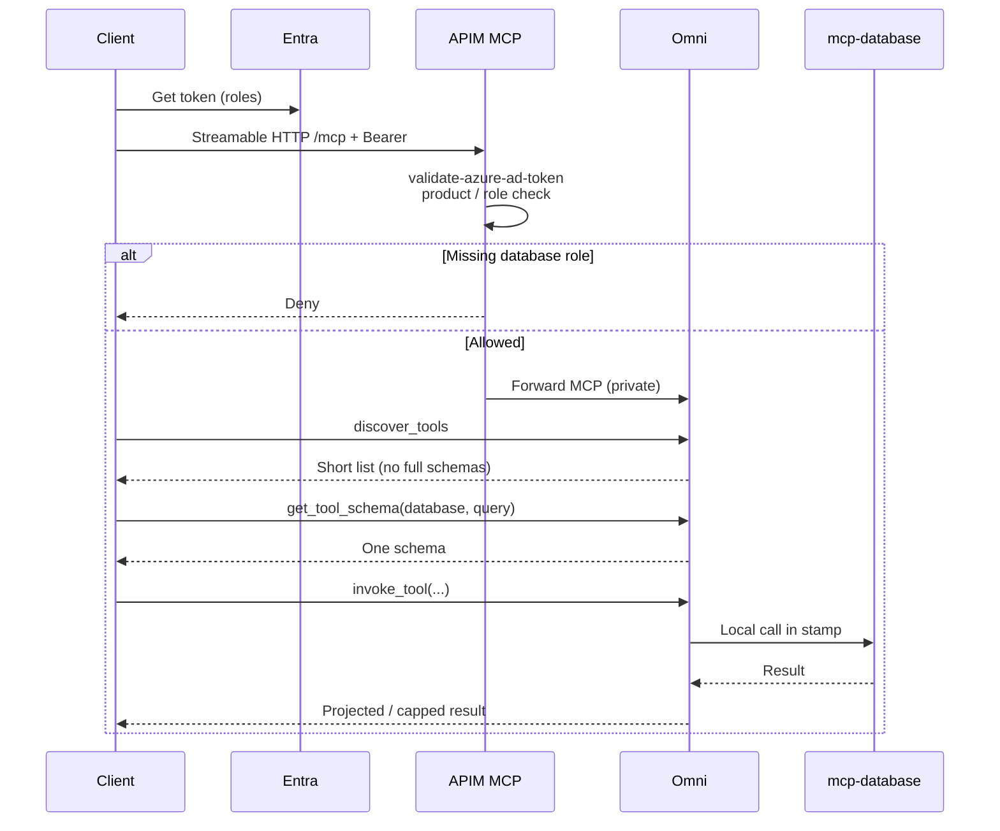

## 9. Deny only, database role missing (later gateway)

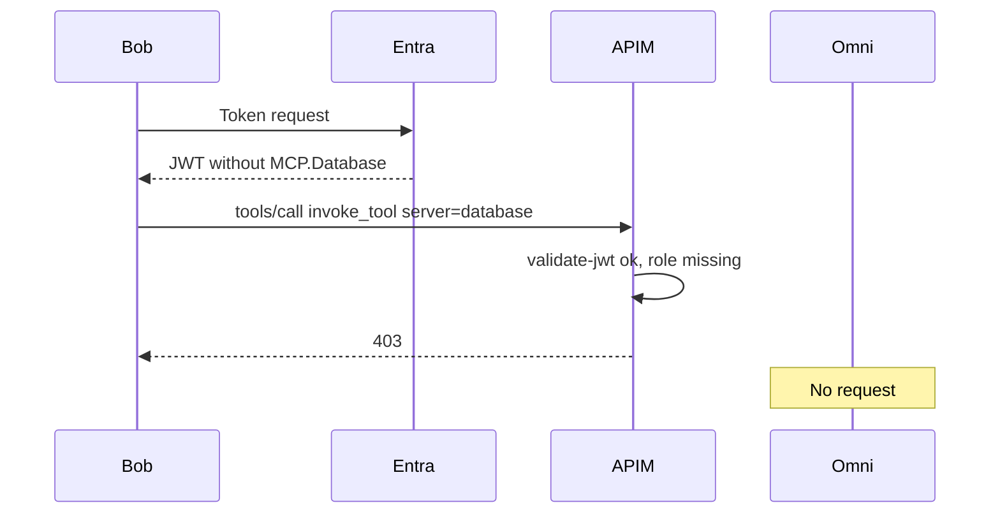

## 10. Phases (later gateway)

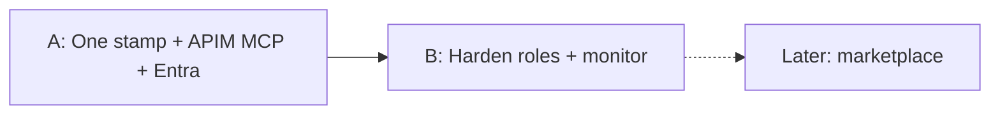

## 11. JWT paths, people and machines (later gateway)

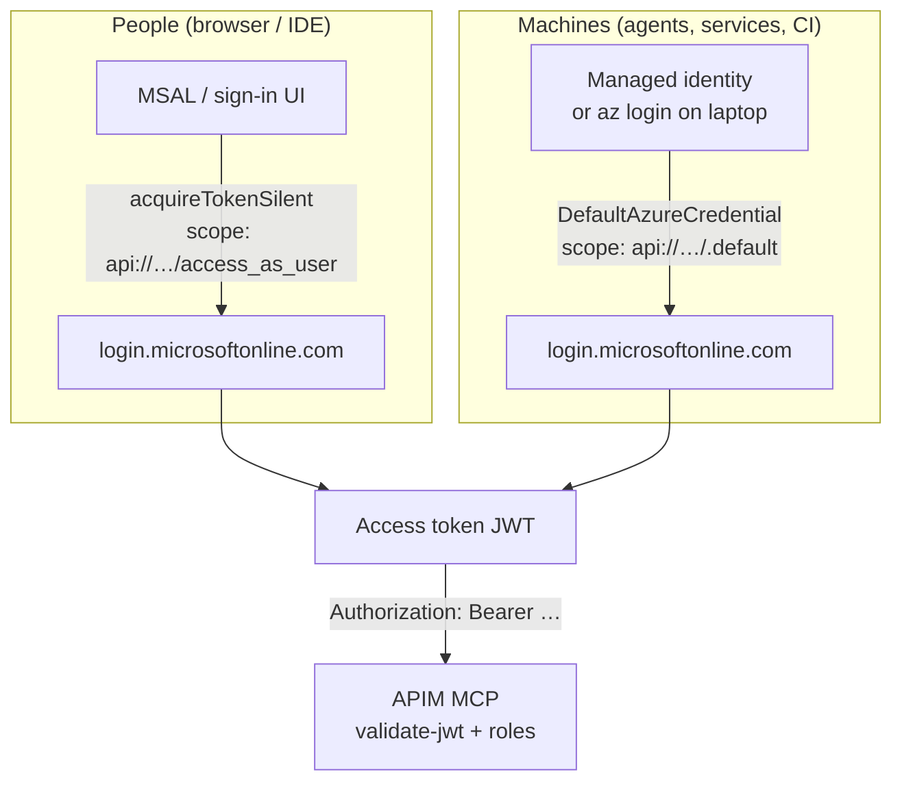

## 12. Machine agent sequence (later gateway)

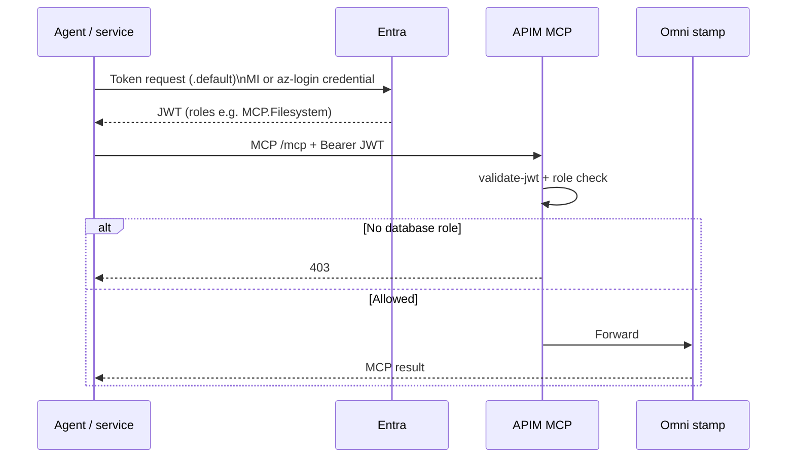

## 13. Ownership, APIM versus mcp-services (later gateway)

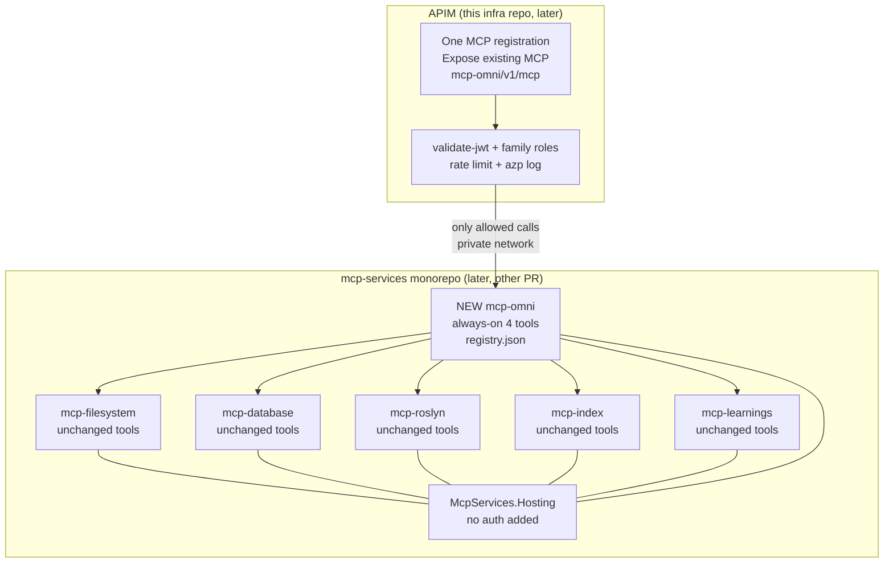

## 14. Local test now, no APIM

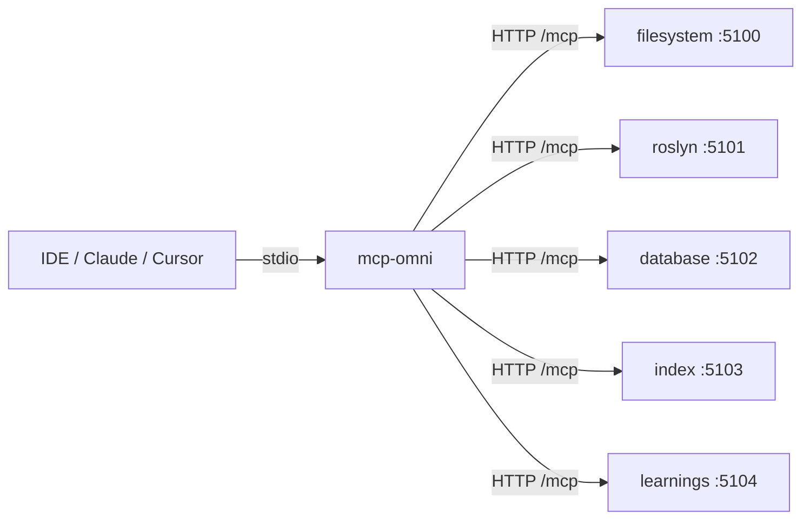

## 15. Local discover, schema, invoke

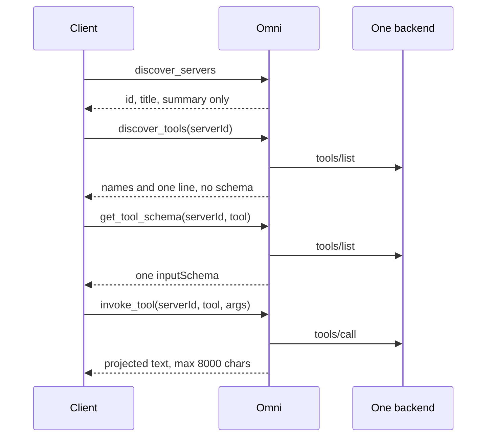
