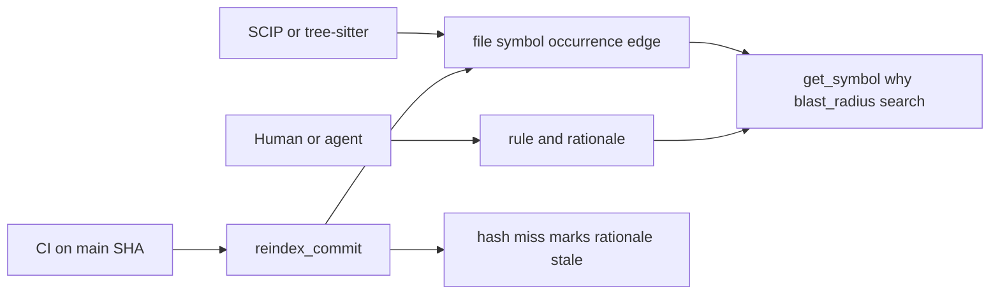

# mcp-index

A persistent, incremental index of one or more repositories so every new agent session starts with knowledge instead of `grep`. It stores file contents (hashed), extracted symbols (C# via the Roslyn syntax API, headings for markdown, generic fallbacks), full-text search, optional embeddings, and free-form notes that agents leave for their successors.

Project: `src/servers/McpServices.Index` · Tests: `tests/McpServices.Index.Tests`

## Running

```
mcp-index [transport options] [--root <dir>]... [--store sqlite:<path>|postgres:<conn>] [--auto-refresh inline|background|off]
mcp-index index|status|verify|rebuild <dir> [--store ...] [--force] [--quiet]      # CLI mode (git hooks, CI)
```

| Option | Meaning |
| --- | --- |
| `--root <dir>` (repeatable, positional) | Repositories tools may index. Default: any directory passed to a tool. |
| `--restrict` | Only allow repositories under the roots. |
| `--store <spec>` | `sqlite:<file>` (default `~/.mcp-services/mcp-index/index.db`) or `postgres:<connection-string>`; env `MCP_INDEX_STORE`. |
| `--auto-refresh <mode>` | `inline` (default): refresh small deltas before answering; `background`: answer now, refresh later; `off`. |
| `--inline-max-files <n>` | Largest delta still refreshed inline (default 200); bigger deltas go to the background. |
| `--max-file-kb <n>` | Skip files larger than this (default 512). |
| `--embeddings <spec>` | `ollama:<model>[@url]` or `openai:<model>[@url]`; env `MCP_INDEX_EMBEDDINGS`, key from `OPENAI_API_KEY`, url override `MCP_INDEX_EMBEDDINGS_URL`. |
| `--watch` | Watch the roots and refresh in the background on file changes. |

`MCP_SERVICES_HOME` moves the default data directory.

## Tools

| Tool | Purpose |
| --- | --- |
| `index_repository` | Incremental index: new/changed files processed, deleted files removed. Safe to call often. |
| `reindex` | Drop and rebuild one repository (notes and feedback are kept). |
| `reindex_commit` | Rebuild derived rows for one commit (`file`, `symbol`, `occurrence`, `symbol_edge`). Does not delete `rationale` or `business_rule`. |
| `why` | Rationale for an anchor at that commit. An empty result means unknown. Pass `includeStale: true` to see stale rows. |
| `blast_radius` | Calls, implements, and references to depth 2, with active rules attached. Hints, not a proof. |
| `upsert_rationale` | Insert a rationale and supersede the previous active row for the same anchor and rule. |
| `index_status` | Counts, last run, freshness versus git HEAD and the working tree, list of changed files. |
| `verify_index` | Integrity check (content mismatches, orphans, FTS consistency); `repair: true` fixes what it finds. |
| `search_code` | Hybrid search: BM25 full text + exact symbol match + feedback boosts + embeddings (if configured), fused with reciprocal rank fusion. Returns a `queryId` for feedback. |
| `search_symbols` | Types, members, functions, headings by (partial) name. |
| `get_symbol` | Declaration(s) with source for an exact or fully qualified name. |
| `get_file_outline` | Symbols of one file in source order with line ranges. |
| `find_related_files` | Git co-change analysis plus shared symbols. |
| `remember` / `recall` / `forget` | Notes for future sessions, linked to files; `recall` flags `possiblyStale` when a linked file changed. |
| `mark_useful` | Boost hits or notes that helped; decays over time. |
| `list_repositories` / `forget_repository` | Manage what the store knows. |

Resource: `index://{repoId}/status`.

## Staying in sync when the MCP is not used

The index is only valuable if it reflects the checkout, and the checkout also changes outside agent sessions (manual edits, `git pull`, branch switches, CI). Defences, in layers:

1. **Content hashes, not timestamps.** Every file row stores a hash; refresh compares hashes, so touched-but-unchanged files are free and edited files are never missed.
2. **Freshness check on every read.** Read tools compare git HEAD and the working tree against the last indexed state. With `inline` they refresh first when the delta is small; with `background` they answer and refresh after; the response carries a `freshness` block (`stale`, changed files, indexed vs current HEAD, `refreshAction`) either way. `stale` is `null` when the check could not decide (huge checkout without git).
3. **Git hooks.** `scripts/install-git-hooks.sh [repo]` adds `post-checkout`, `post-merge` and `post-commit` hooks that run `mcp-index index <repo> --quiet`. Existing hooks are preserved (the call is appended). Disable temporarily with `MCP_INDEX_HOOKS=off`.
4. **`--watch`.** A file-system watcher for long-running servers (Docker, HTTP mode).
5. **CLI mode in CI.** `mcp-index index .` after checkout, `mcp-index verify .` to fail a pipeline on corruption.
6. **`verify_index` / `reindex`.** Recovery when something did go wrong (for example a store copied between machines).

Notes survive all of this: `reindex` and `forget_repository` treat notes differently (kept for reindex, removed only when forgetting the repository). Rationale does not go through `remember`, `forget`, or `forget_repository`. Old notes stay notes. They are not imported as rules.

## Commit knowledge

The content-hash index (`files`, `symbols`, `search_code`, `get_symbol`) stays as it is. `repoId` stays a hash of the checkout path, so two worktrees are two indexes. Commit-keyed tables sit beside it and use `(repo_id, commit_sha)`.

Derived rows are rebuilt by `reindex_commit` for that commit only: `file`, `symbol`, `occurrence`, `symbol_edge`. Authored rows are not rebuilt and are not deleted by that tool: `business_rule`, `rationale`, `ticket`, `agent_session`, `link`, `line_span`. Agents supersede a rationale or mark it rejected. They do not delete those rows. Hard-delete of rejected rows, and of stale rows whose symbol is confirmed gone, is a later cleanup job.

A symbol key is `(repo, commit_sha, scip_symbol)` when a SCIP indexer produced one. Otherwise it is `(repo, commit_sha, path, kind, name, start_line, start_col)`. Rationale hangs off `anchor_key` (that symbol key). Line numbers on a rationale are a hint. Docstrings stay on `symbol`. They are not rationale. `why` does not copy them. Confidence, source, and anchor are required. The why text is at most 500 characters and cannot contain a markdown heading. The database rejects a bad row.

`upsert_rationale` inserts a new row. When the symbol hash matches, the new row is active and the previous active row for the same `(repo, anchor_key, rule_id)` becomes superseded. A hash mismatch is rejected unless `forceStale` is true, in which case the row is stored as stale and the active row is left in place. `why` omits stale rows unless `includeStale` is true. A hash that does not match the commit is treated as stale for that read, so a rationale written for another snapshot does not answer `why` there.

`reindex_commit` reads the git tree at that commit, not uncommitted files. When `index.scip.json` or `index.scip` is in the checkout, that SCIP index supplies symbols and edges. Otherwise the commit is parsed as a syntax graph (C# syntax, plus the existing line patterns for other languages): declarations, calls, base types, and identifier references. That is the tree-sitter slot for this slice. It rebuilds the whole commit. It is not an incremental index and it is not a proof. There is no GitHub Actions SCIP job. Existing git hooks still call `mcp-index index` for the content-hash index. A local hook may tree-sitter the changed files. This slice does not add that hook.

Work stays on the commit that was indexed. Merging reindexes the merge commit. A conflict does not change the rationale that still matches `main` until that merge commit is indexed. If the merge symbol matches neither side, both old rationales are marked stale and the resolution needs a new `upsert_rationale`. `search_code` does not wait on SCIP. Empty commit-symbol rows do not hide the content-hash index. `get_symbol` is unchanged and has no `includeStale` flag.



Two labels in that picture are not this pull request. There is no Actions SCIP job yet (`ci` is that later step). `search` in the picture is the later tool `search_rationale`, which is not implemented here. `get_symbol` and `search_code` stay as they are.

## Client configuration

```json
{
  "mcpServers": {
    "index": {
      "command": "mcp-index",
      "args": ["--root", "/home/sven/src/my-repo", "--auto-refresh", "inline"]
    }
  }
}
```

Docker: the `index` service uses the bundled PostgreSQL (`MCP_INDEX_STORE=postgres:...`), `--watch --auto-refresh background`, and optional `MCP_INDEX_EMBEDDINGS` on `http://127.0.0.1:5103/mcp`.

## Storage notes

- SQLite uses FTS5 for full text; PostgreSQL uses `tsvector` with GIN indexes. Embeddings are `BYTEA` (SQLite `BLOB`). This slice does not add a vector column.
- The same `IKnowledgeStore` abstraction backs `mcp-learnings`; both can share a PostgreSQL database.
- One store can hold many repositories; each is keyed by a `repoId` hashed from the canonical root path (symlinks resolved), so two worktrees of the same repository get separate indexes and the same path always maps to the same id.
